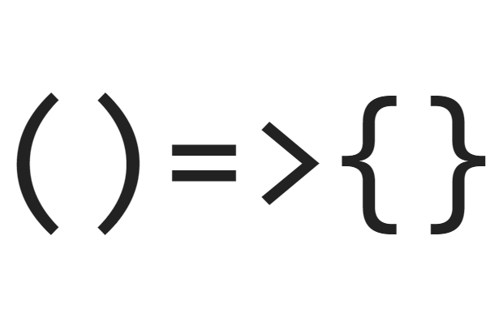

```
string.map(str => str.charAt(0).toUpperCase()+str.slice(1)))).join("");
```

Are you clueless what the above line of code mean ?

That’s because it has been shortended using arrow function, and trust me it is no fancy. You can also write codes like these once you completely understand the arrow function. Lets get started…

---

_Let’s understand the syntax and how different it is from the normal function syntax :_

```
function helloWorld() {
   console.log("Hello World");
}
//output: Hello World
```

_The above function can be written as below using arrow function:_

```
()=> console.log(“Hello World”); 
//output: Hello World
```

Arrow functions come to your rescue, when we need to use multiple function within **methods** like **map, reduce, filter** etc.

```
var multiplyBy2 = [1,2,3,4].map(num => num * 2) ; 
console.log(multiplyBy2);

//output: [2, 4, 6, 8]
```

Using **ternary operators** in addition to **arrow** functions, adds to the magic. It can reduce 3 - 4 lines of code to single line code.

```
//returns largest number in the array

[11, 101, 50, 66].reduce( (a,b) => (a>b) ? a:b);

//output: 101
```

---

This concludes my article on arrow function, hope you enjoyed reading it.

If you like it please press clap & also provide your valauable feedback.
