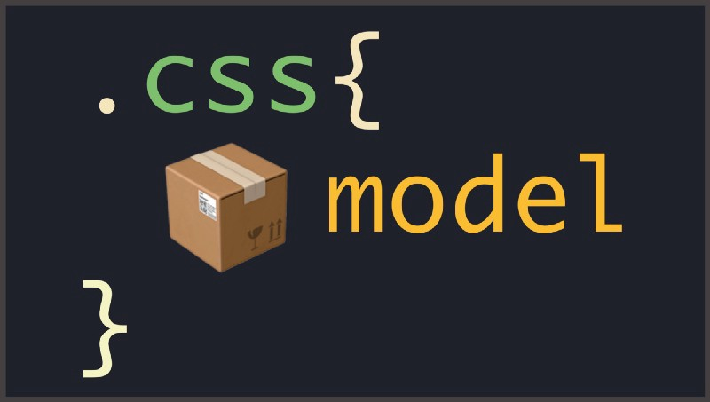
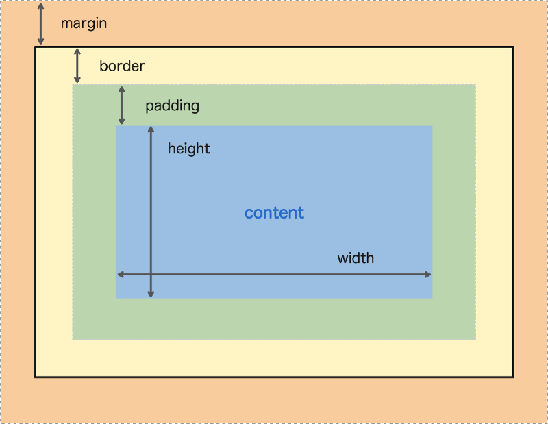

Till now we’ve seen that by default, there are two types of elements in HTML i.e, block-level elements and inline-level elements. We have also seen the difference between them. We know that block-level elements always start from a new line and take the available width and inline-level elements take the space as much as it requires according to the content and lines up one after the other. In an HTML document, the block-level or the inline-level elements or inline-block level element, are all interchangeble by the display property.

### Display Properties:

The Display property in CSS defines how the components(div, hyperlink, heading, etc) are going to be placed on the web page. As the name suggests, this property is used to define the display of the different parts of a web page.

**Inline:** It is used to displays an element as an inline element. we can also use it to change the display property value to inline.

```
p {
    display: inline;
  }
```

**Block:** Block-Level elements accept all the box-model(height, width, margin, padding) properties and values. To convert any element into a block-level element we just need to change its display property to block.

```
div {
    display: block;
  }
```

**Inline-Block:** An inline-level element does not accept all the box-model properties and values. So we have another display property value i.e. `inline-block`.

```
div {
    display: inline-block;
  }
```

**None:** To hide any element from the page we can set its display property value `none`.

```
p {
    display: none;
  }
```

**\*Note:** there is another property `visibility: hidden`, to hide any element.

### Box Model:



Before starting box model one thing we should keep in mind that in HTML, by default, every element is a rectangular shaped object. All the elements, irrespective of the shape in which they appear on the web page, are drawn and treated by the browser as a rectangular box. This box may have some width, height, padding, borders, and margins. So let’s discuss these properties.

**Width:** Every element has some default width based on the display property. If it is a block-level element it will have 100% width covering whole horizontal space. If it is an inline or inline-block element it will have width according to the content it wraps. To set a specified width to an element we can use the width property.

```
div {
    width: 300px;
  }
```

**Height**: As every element has some default width in a similar way every element also has some default height and that is always determined by its content. Similarly width, height also cannot be fixed for the inline-level elements. So to specify the height of non-inline elements we can use the height property.

```
div {
    height: 300px;
  }
```

**Padding:** The padding property allows you to specify how much space should appear between the content of an element and its border.

Shorthand:

```
div {
    padding: 20px;
  }
```

This is the shorthand property to apply padding on all the four sides of the element.

```
div {
  padding: 20px 40px;
}
```

This is another shorthand property to apply padding. The first value is for the top and bottom padding and the last value is for left and right padding.

To set unique values for individual side padding we can define something like this

```
div {
  padding: 10px 0 20px 30px;
}
```

Longhand :

In the longhand properties, we can set value for one side at a time.

```
div {
    padding-top: 10px;
    padding-right: 0;
    padding-bottom: 20px;
    padding-left: 30px;
  }
```

**Margin:** The CSS margin properties are used to create space around elements, outside of any defined borders.

```
div {
    margin: 10px 20px 10px 20px;
  }
```

**Border:** The border is to provide some outline around an element. To apply border we have border property which requires three different values i.e. border-width, border-style and border-color.

```
div {
	border: 10px solid red;
}
```

The above border property has shorthand values which will provide a `10px` border of red color around the element on all the four sides. In the longhand, we can apply all the above values individually.

```
div {
    border-width: 10px;
    border-style: solid;
    border-color: red;
  }
```

To apply border on the individual side we can say define individually like, `border-top, border-right, border-bottom, and border-left`.

```
div {
    border-bottom: 10px solid #272727;
  }
```

Again here this is shorthand values for the border-bottom property. In the longhand values we can say something like this:

```
div {
    border-bottom-width: 10px;
    border-bottom-style: solid;
    border-bottom-color: #272727;
  }
```

### Calculate the total width and the height of an element:

The total height of an element can be calculated as below:

-   **Total height** = margin-top +border-top + padding-top +height+ padding-bottom + border-bottom + margin-bottom.
-   **Total Width** \= margin-left +border-left + padding-left +width+ padding-right + border-right + margin-right

**Note:** ‘Outline’ property is not part of box model, so not considered for above calculation.

**Thanks** reading, please feel free to leave your comments & feedbacks.
