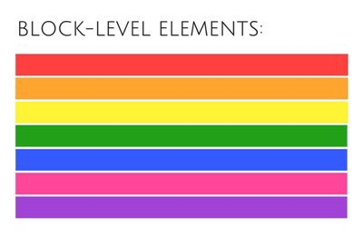

Hello, This is Anupam and it’s my first story here in medium. In this post, we will learn about some basic HTML concepts.

So before we start, lets understand that basically web pages are made up of three components **HTML**, **CSS** and **JavaScript**. While **HTML** provides the base or skeleton to the webpage, **CSS** to provides the styling & colors to it, and finally **JavaScript** adds interactivity to the web page.

**HTML** or **H**yper **T**ext **M**arkup **L**anguage is not a programming language, it is a markup language. **Markup languages** are designed to tag/mark elements within a document. **Markup languages** are human readable, so mainly contain standard words rather than typical programming syntax.

HTML was first developed by Tim Berners-Lee in 1990. After that many HTML versions were released, the current version of HTML is **HTML 5**. Lets move on to understand various **terms** in HTML**.**

### Elements, Tags and Attributes:

An HTML document has three components-

1.  **Elements:** Elements are the basic building block of an HTML document.

**2\. Tags**: Once we wrap the element name in between the less than and greater than angle bracket then it becomes a tag. Tags mostly appear in a pair of opening and closing tag. The closing tag is written like the opening tag, but with a forward slash `/` inserted before the element name.

\*There are few tags like ``, `<meta>`,` ` which does not require any closing tag, so known as self-closing tag.

**3\. Attributes:** Attributes provide some extra information about the element. eg: href, src, alt etc.

### Semantic and Non-semantic Elements:

**Semantic Element:** A semantic element clearly describes its meaning to both the browser and the developer.

\*Semantic elements = elements with a particular meaning.

\*Examples of semantic elements: `<header>`,`<footer>`,`<section>`,`<article>`, `<aside>`, `<main>`,`<nav>` etc.

**Non-Semantic Element: N**on-semantic element has no special meaning at all.

\*Examples of non-semantic elements: `
`, ``.

### Inline and Block Level Elements:

**Block Level Element:** A block-level element always starts on a new line, stacks on top of each other and takes up the full width available. It can have margin and padding.

\*Example of Block Level Element: `
`, `
`, `<section>`,`<article>`,`<aside>`,`<nav>`,`<pre>`,`<header>`,`<footer>`,`<form>` etc.

**Inline Element:** An inline element does not start on a new line and only takes up as much width or horizontal space as the size of the element.

\*Example of Inline Element: `<a>`, `<b>`, `<i>`, ``, ` `, `<q>`, ``,`<small>`,`<big>,<button>`, `<strong>`, `<em>`, ``, ``, `<input>` etc.

**Thanks** for reading, please feel free to leave comments or feedback.
