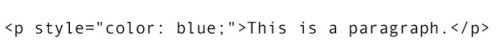
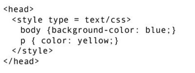
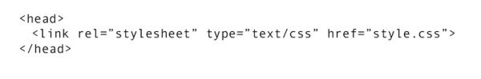
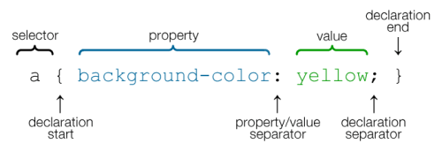
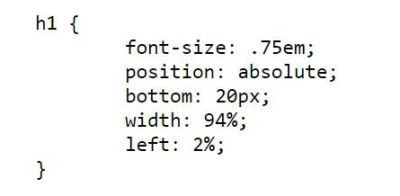
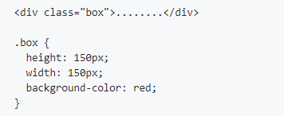

#### Introduction to CSS ( Cascading Style Sheets ) :

-   CSS stands for Cascading Style Sheets. CSS is designed to enable the separation of presentation and content, including `layout`, `colors`, and `fonts`.
-   CSS was first proposed by Håkon Wium Lie on October 10, 1994. At the time, Lie was working with Tim Berners-Lee at CERN.
-   To create a CSS file we need to open any text editor and save the CSS document with `.css` extension.

### Methods of Implementing CSS:

**Inline:** With inline styles, style sheet information is applied directly to the HTML element. Instead of defining the style once, then applying the style against all instances of an element, you add the style directly to the specific element you want the style to apply to.

**Internal:** With Internal style sheet you can add all CSS information to one part of the document (usually inside the `<head>` tag). This allows you to style any element on the page from a single place. You do this by embedding the CSS information within `<style>` tags in the head of your document.

**External:** External style sheets are the most common method of applying styles to a website. Here we create a separate file that contains all style information. This file is then linked to as many HTML pages as you like by using `<link>` tag.

### Selectors, Properties and Values:

**Selectors:** Selectors are used to target (or select) the HTML elements you want to style.

**Properties:** Property determines the style that needs to be applied.

**Values:** Value determines the behaviour of the property.

### Types Of Selectors:

1.  **Type Selector:** When we target(select) an element with the element name or type.

**2\. Class Selector:** The class selector selects HTML elements with a specific class attribute. To select an element with a specific class, write a full stop`(.**)**` followed by the class name of the element.

**3\. ID Selector:** The id selector  uses the id attribute of an HTML element to select a specific element. The id of an element is unique within a page, so the id selector is used to select one unique element. To select an element with a specific id, write a hash or pound (`#`) character, followed by the id of the element.
