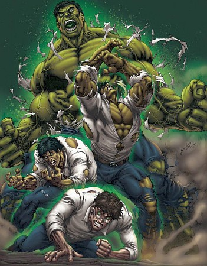

Remember the plot of American superhero movie “The Incredilble Hulk”, how modifying DNA sequences or mutation of genes could some how create monstorous hulk. Moving from from **reel** to **real** life. In biology, a mutation is the alteration of the nucleotide sequence of the genome of an organism, virus, or extrachromosomal DNA.

---

Enough of side talks, let’s take a look into Javascript perspective of this topic.

So any javascript method which does operation and inturn changes the original string or array i.e. mutates it.

**List of array mutators:**

-   `[copyWithin](https://developer.mozilla.org/en-US/docs/Web/JavaScript/Reference/Global_Objects/Array/copyWithin)`
-   `[fill](https://developer.mozilla.org/en-US/docs/Web/JavaScript/Reference/Global_Objects/Array/fill)`
-   `[pop](https://developer.mozilla.org/en-US/docs/Web/JavaScript/Reference/Global_Objects/Array/pop)`
-   `[push](https://developer.mozilla.org/en-US/docs/Web/JavaScript/Reference/Global_Objects/Array/push)`
-   `[reverse](https://developer.mozilla.org/en-US/docs/Web/JavaScript/Reference/Global_Objects/Array/reverse)`
-   `[shift](https://developer.mozilla.org/en-US/docs/Web/JavaScript/Reference/Global_Objects/Array/shift)`
-   `[sort](https://developer.mozilla.org/en/JavaScript/Reference/Global_Objects/Array/sort)`
-   `[splice](https://developer.mozilla.org/en-US/docs/Web/JavaScript/Reference/Global_Objects/Array/splice)`
-   `[unshift](https://developer.mozilla.org/en-US/docs/Web/JavaScript/Reference/Global_Objects/Array/unshift)`

---

This article was insired from below website, for easy referencing you can use the doesitmutate.xyz

[**Does it mutate?**  
_The concat() method is used to merge two or more arrays. This method does not change the existing arrays, but instead…_doesitmutate.xyz](https://doesitmutate.xyz/ "https://doesitmutate.xyz/")
