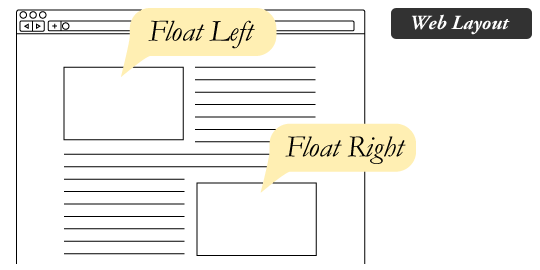
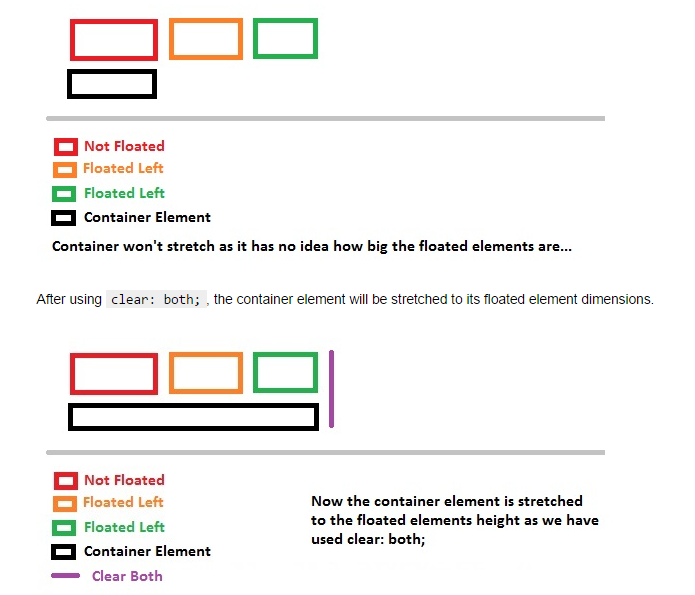
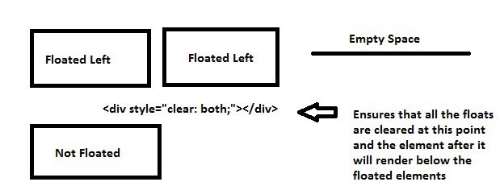
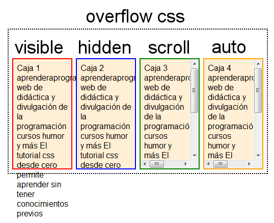

By now we only learnt to create a single column type layouts. Whenever we take any block level element, it always takes the whole available horizontal width and comes one after another vertically. But, creating websites is not just about creating boxes and a single-column layout. So, to create more complex layouts having a number of columns and rows, we will learn positioning with floats.

### Positioning with floats :



The float property places an element to left or right side of its container, allowing text and inline elements to wrap around it. The element is removed from the normal flow of the page, though still remaining a part of the flow.

The float comes with three different values.

-   **left :** The element floats to the left of its container
-   **right:** The element floats to the right of its container
-   **none** : The element does not float (will be displayed just where it occurs in the text). This is the default value.

### Float may change the display property:

When we float any element then it is removed from the normal flow of the page which also alters the default display property of the element. This means a block-level will start taking the space according to the content it wraps despite their default display property of taking available width. To fix this behavior we will have to apply some fixed-width according to the need.

```
div {
    float: left;
    width: 400px;
    height: 300px;
  }
```

When an inline-level element like span is floated it should start accepting the box model properties like width and height.

```
span {
    float: right;
    width: 400px;
    height: 300px;
  }
```

### Clearing and Containing the floats :

The float affects the normal flow of elements on a page and the rest of the elements bleed into the floated elements and the default display behavior of an element changes using floats.

So, to make the use of floats in a more effective way we need to win over the disadvantage of floats. Sometimes we may find the proper styles are not rendering. We need to remove the unwanted behavior of floats. So to bring the elements into a normal flow on a page we will have to clear or contain, those floating effects.

**1.Clear :** The clear property specifies what elements can float beside the cleared element and on which side.

The clear property can have one of the following values:

-   **left:** No floating elements allowed on the left side
-   **right:** No floating elements allowed on the right side
-   **none :** Allows floating elements on both sides. This is the default value.



2\. **Placing an empty div:** In this case, we place an empty div before the closing tag of the parent element and set its style to clear: both.

```
<header>..........</header>
  <div>
    <section>..........</section>
    <aside>..........</aside>
    <div class="clear"></div>
  </div>
  <footer>..........</footer>  section {
    float: left;
  }
  aside {
    float: right;
  }
  .clear {
    clear: both;
  }
```

Containing floats in this way is not efficient, it is not even semantically correct.



3\. **Overflow technique:** The Overflow Method  relies on setting the overflow CSS property on a parent element. If this property is set to auto or hidden on the parent element, the parent will expand to contain the floats, effectively clearing it for succeeding elements. This method can be beautifully semantic as it may not require additional elements. However if you find yourself adding a new div just to apply this, it is equally as non-semantic as the empty div method and less adaptable. Also bear in mind that the overflow property isn’t specifically for clearing floats. Be careful not to hide content or trigger unwanted scrollbars.

```
<header>..........</header>
  <div class="parent">
    <section>..........</section>
    <aside>..........</aside>
    <div class="clear"></div>
  </div>
  <footer>..........</footer>

  .parent {
    overflow: hidden;
  }
  section {
    float: left;
  }
  aside {
    float: right;
  }
```

4\. **Clearfix Technique:** One of the most effective ways to contain floats is the clearfix method. The clearfix technique is more preferable and has advantages over other techniques.

In this method, we apply a class to parent element containing floated elements and then we define some sort rules to that class in CSS. It would be better to define a modular class so that we can use the same class again and again wherever we will float the elements on a page. One of the most popular class name that generally developer use for this purpose is `clearfix` .

```
clearfix:before, .clearfix:after {
    content: "";
    display: table;
  }
  .clearfix:after {
    clear: both;
  }
```

After and before pseudo-elements creates dynamic content above and below the class wherever we apply. In the above code, the before and after pseudo-element will create a hidden element above and below the clearfix class which we have applied to our parent. We displayed the pseudo-elements as a table, just to make it block-level element so that it should take full available width above and below the element. We displayed it to a table just to ensure consistency for the older version of internet explorer or else display block will also work fine. we also applied clear: both. This is to clear floats so that the next upcoming element does not get wrapped around the floated elements.

**Thanks** for reading. Please feel to comment or provide any feedback.
