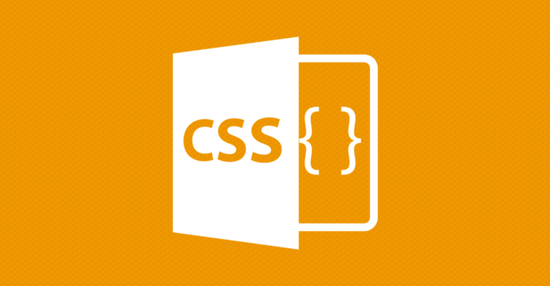
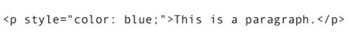
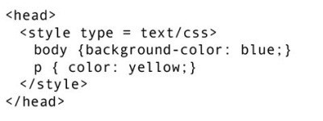
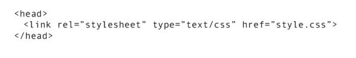
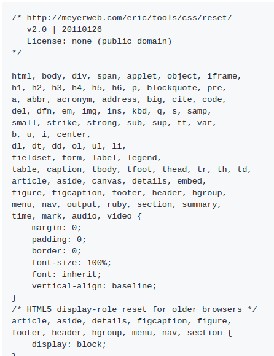
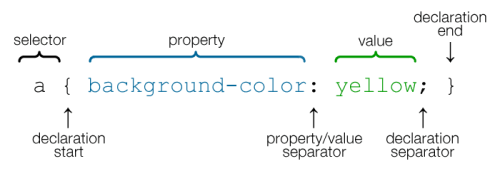
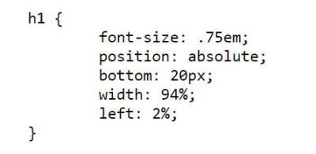
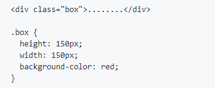
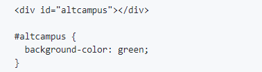

**C S S** stands for **C**ascading **S**tyle **S**heet is a stylesheet language used to describe the presentation/styling of a document written in **HTML. CSS** was designed for adding style (e.g., fonts, colors, spacing) to web pages.

CSS was first proposed by Håkon Wium Lie on October 10, 1994. At that time, Lie was working with Tim Berners-Lee at CERN. Let’s move on to understand how CSS is implemented.

### Implementing CSS:

**Inline:** For  inline style, CSS information is applied directly to the HTML element. We use style as an attribute to the specific element we want the style to apply to.

**Internal:** For internal style, CSS information is added to HTML document inside the `<head>` tag. This allows you to style any element on the page from a single place. The CSS information is added within `<style>` tags in the head of your document.

**External:** External style sheets is the most common method of applying style to a website. Here we create a separate file that contains all style information. This file is then linked to as many `HTML` pages as you like by using `<link>` tag.

### CSS Resets

While coding we need to take care of all the browser, each one of which interpret styling differently. So as we need uniform styling across all the browsers, we use `CSS` reset to give all the styling a zero/100% value. Example: [Eric Meyer’s reset](https://meyerweb.com/eric/tools/css/reset/).

### Selectors, Properties and Values:

**Selectors:** Selectors are used to target (or select) the HTML elements you want to style.

**Properties:** Property determines the style that needs to be applied.

**Values:** Value determines the behaviour of the property.

### Types Of Selectors:

1.  **Type Selector:** When we target(or select) an element with the element name or the type of the element.

**2\. Class Selector:** The class selector selects HTML elements with a specific class attribute. To select an element with a specific class, write a full stop`(.**)**`  followed by the class name of the element.

**3\. ID Selector:** The id selector  uses the id attribute of an HTML element to select a specific element. The id of an element is unique within a page, so the id selector is used to select one unique element. To select an element with a specific id, write a hash or pound `#` character, followed by the id of the element.

Thanks for reading the article, feel free to leave your comments/feedbacks.
