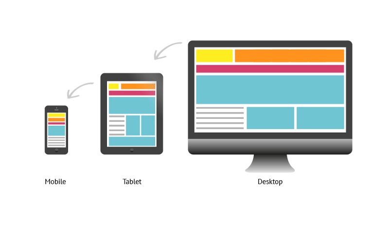
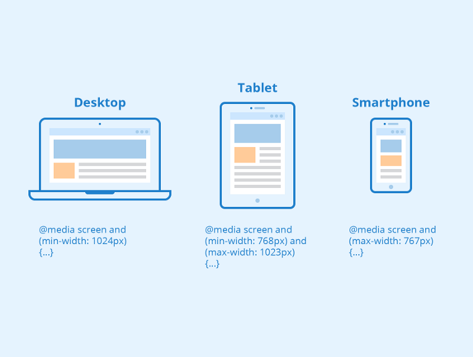
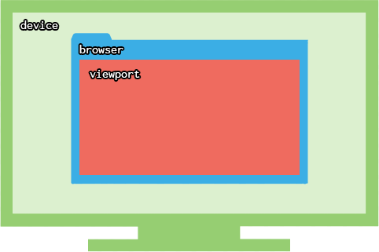

The term responsive design was coined by Ethan Marcotte in 2010. “Responsive design” refers to the idea that your website should display equally well in everything from widescreen monitors to mobile phones. It’s an approach to web development that eliminates the distinction between the mobile-friendly version of your website and its desktop counterpart.

Responsive design mainly done using “**media queries**”. Media queries is a way to conditionally apply CSS rules. They tell the browser that it should ignore or apply certain rules depending on the user’s device type. Let’s see some details.



### Media Queries:

Media queries are nothing but a way of telling the browser what CSS styles to show at a particular state. Media Queries allow us to run a series of tests (e.g. whether the user’s screen is greater than a certain width, or a certain resolution) and apply CSS selectively to style the page appropriately for the user’s needs. media query is a logical expression it can be resolved to either true or false. The result of the query will be true if the media type specified in the media query matches the type of device the document is being displayed on, as well as all expressions in the media query, are satisfied. When a media query is true, the related style sheet or style rules are applied to the target device.

A media query is composed of an optional **media type** and any number of **media feature** expressions. Let’s discuss what is media type and media features.

### Media type :

One of the most important features of style sheets is that you can specify separate style sheets for different media types. This is one of the best ways to build printer-friendly Web pages — Just assign a different style sheet for the “`print`” media type.

Some CSS properties are only designed for certain media. For example, the page-break-after property only applies to paged media. However, there are several properties that may be shared by different media types but may require different values for that property.

### Media Feature:

Media features identify what attributes or properties will be targeted within the media query expression. Let’s discuss some media features.

**a. Width:** Describes the width of the targeted display area of the output device. This is a range value, which means that you can also use min-width and max-width.

**b. Height:** Describes the height of the targeted display area of the output device. This is a range value, which means that you can also use max-width.

**c.** **Aspect Ratio:** The ratio of the value of the width media feature to the value of the height media feature.

**d. Orientation:** Describes the orientation of the device. It is portrait when the value of the height media feature is greater than or equal to the value of the width media feature.

**e. Resolution:** Describes the resolution of the output device (i.e. the density of the pixels).

### Logical Operators in Media Queries

Logical operators in media queries help build powerful expressions. There are three different logical operators available for use within media queries, including _and_, _not_ and _only._

**and:** The _and_ keyword is used for combining multiple media features together, as well as combining media features with media types.

\*Example: `@media tv and (min-width: 700px) and (orientation: landscape) { … }`

**not:** The _not_ keyword applies to the whole media query and returns true if the media query would otherwise return false.

\*Example: `@media not screen and (color) {…}`

**only:** The only logical operator is a new operator and is not recognized by user agents using the HTML4 algorithm, thus hiding the styles from devices or browsers that don’t support media queries.

\*Example: `@media only screen and (orientation: portrait) {…}`

### Viewport:



Browser’s viewport is the area of a web page in which the content is visible to the user. The viewport does not have the same size, it varies with the variation in screen size of the devices on which the website is visible. For a laptop, the viewport has a larger size as compared to a smartphone or tablet.

The common setting of the viewport is —

```
<meta name="viewport" content="minimum-scale=0">
```

`**content=width=device-width **`**:** it sets viewport to a special value(“`width= device-width`”) which is the width of the device in terms of CSS pixels at a scale of 100%

**initial-scale:** initial-scale property governs the zoom level when the page is loaded for the first time.

### Flexible Media:

Responsive web design involves flexible media. As viewports begin to change size media doesn’t always follow suit. Images, videos, and other media types need to be scalable, changing their size as the size of the viewport changes.

To make media scalable is by using the `max-width` property with a value of `100%`. Doing that as the viewport gets smaller any media will scale down according to its containers width.

```
img, video, canvas {
  max-width: 100%;
}
```

### Flexible Embedded Media:

The `max-width` property doesn’t work well for all instances of media, specifically around `iframe`s and embedded media. When it comes to third party websites, such as YouTube, who use iframes for embedded media this is a huge disappointment.

```
<figure>
  <iframe src="https://www.youtube.com/embed/4Fqg43ozz7A"></iframe>
</figure>
```

Thanks for reading. Please feel free to comment.
