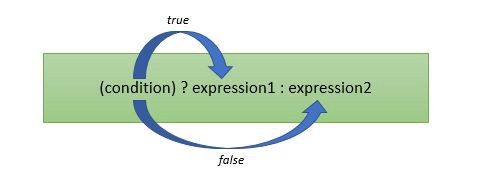

### What is a programming language?

A programming language is a computer language that is used by software developers to execute a set of instructions or programs.

Learning a programming language gives you the magical powers of making your computer do any thing you want. As programming languages are not very similar to human langauages, and learning a programming language can be tricky. So, to take the first step towards understanding & delving deeper into the wonderful world of programming we need to understand the four essential task needed to be done by any programming language. The examples we will use here will be in reference to javascript.

1.  Store of value.
2.  Store of action.
3.  Conditions.
4.  Loops.


### Store of value:

The foremost important task any programming language need to take care is storing of values. There are two types of values in javascript:

1.  **Primitive values**
2.  **Non-primitive values**

Primitive values are `**string**, **number**, **bigint**, **boolean**, **null**, **undefined** and **symbol**.`

Non-primitive values are **object**, **array** and **functions**.


### Store of action:

Store of action means we can store some steps or instruction to function, which can be called any time we require that specific task to be done. There reduces the effort or writing the same instructions again & again.

eg: Function declaration:

```
var add = function(num1, num2) {

return num1+num2;

}
//Here add is function, which is stored as object in JavaScript.
```

### Conditions:

Conditional statements are used to perform different actions based on different conditions. The most comon conditions are `**switch**, **if**, **else**, **else if** and **ternary operator**.`

eg: Checking `odd` or `even`

```
if(n%2 == 0)
alert(“n is a even number”);
```

### Loops:

Loops can execute a block of code a number of times. This comes handy when we need to execute the same code again & again with different values. The most commonly used loops are `**for, while** and **do while**`**.**

eg: For Loop:

```
var sum = 0;

for(let i = 1; i ≤ 10; i++) {
sum = sum + i;
}
//Output will be sum of all digits from 1 to 10.
```

---

This concludes my article hope you enjoyed reading it. If you like it please press clap & also provide your valauable feedback.
