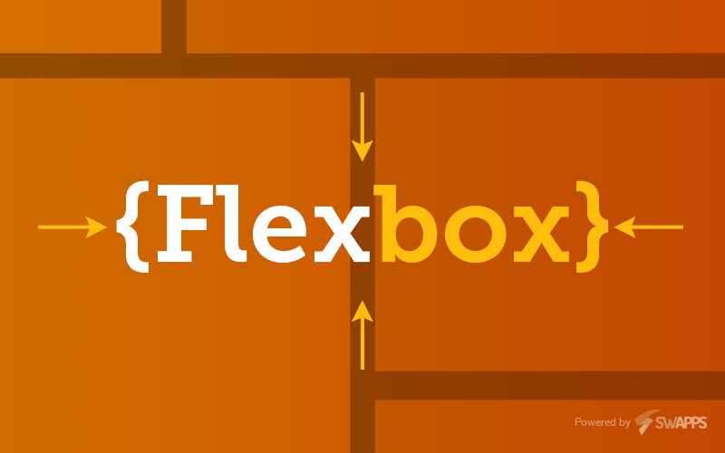
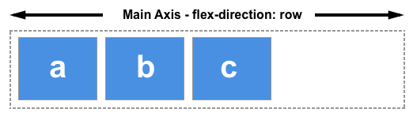
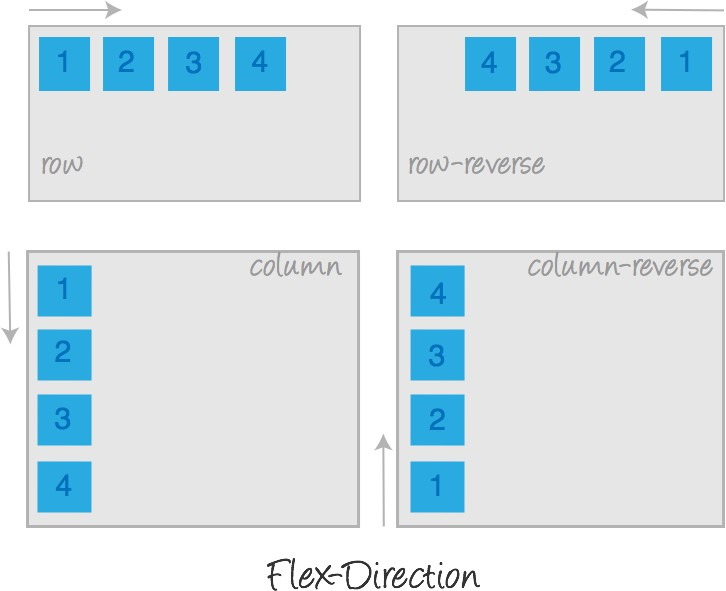
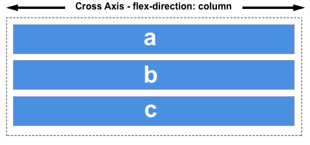
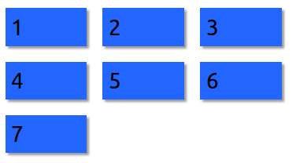
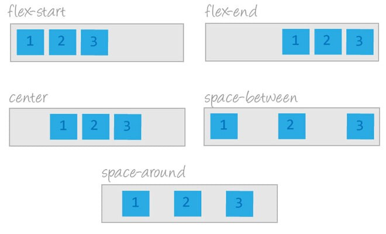
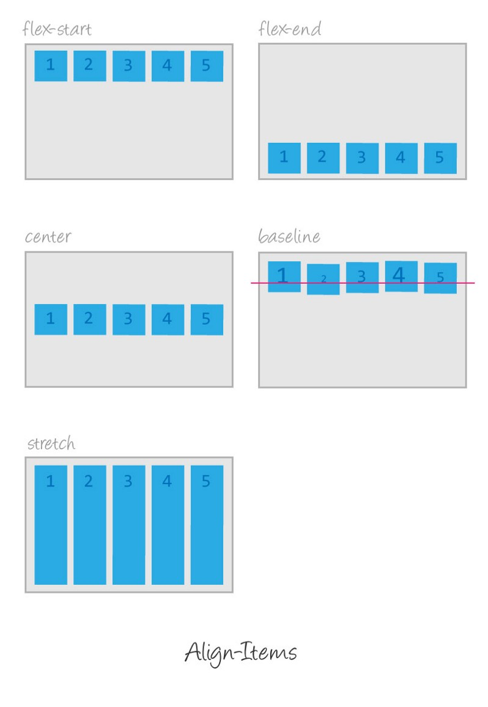

As of now we learnt about the floats and inline-block as well as a few advanced properties to position the elements. Positioning using them is surely not easy, we all have been through the pains while working with the floats and a few other properties of positioning. So we will move to flexbox to make our lives more easier. Flexbox, makes it easier to design a flexible responsive layout without using any float or positioning properties.



### What is flexbox?

Flexbox provides us a more efficient way to layout elements. It gives us the ability to align the items and distribute space among the items in a container even though the size of the elements is unknown or dynamic. With the flexbox we get the power of flexibility(as the word flex says) in order to fill the available space. So that elements can easily accommodate according to the size of screens. In a flexbox container, the item expands to fill the free space as well as shrinks to prevent overflow.

### Basics Of Flexbox:

1.  **Flexbox model** comes with some sets of properties and values. To make use of those flexbox model properties and values we have to set the parent’s styles as display: flex. Once we do so we are in the zone of the flexbox model.

```
.container {
    display: flex;
  }
```

1.  In f**lexbox model**, there are two axis: **main axis** and **cross axis.**
2.  **Main axis:** The main axis in the flexbox model is the primary axis along which the items are laid out in the flex container. The main axis is not necessary to remail always in the horizontal direction. We can anytime interchange the direction of axes. The main-axis  is defined by flex-direction which has four possible values:



-   **row:** This is the default value for the flex-direction property. After applying this property you won’t find any changes.
-   **row-reverse:** The row-reverse is similar to row but this all the item will sit from right to left means in the opposite direction.
-   **column:** All the items in the flex-container will lay down top to bottom. This value changes the direction of the axes in the flexbox model. The main axis takes the place of the cross-axis and the cross axis takes the place of the main-axis.
-   **column-reverse:** The column-reverse is also opposite to the column. The item will lay down from bottom to top.



3\. **Cross Axis:** The cross axis goes perpendicular to the main axis. It feels like “vertical direction”, top to bottom.



### A. Flexbox container:

A flex container expands items to fill available free space or shrinks them to prevent overflow. In the Flexbox Model, we apply a few properties on the flex-container (parent) and few on the flex-items (children).

The children elements inside the flex container. are known as an items. Let’s understand the container property.

### 1\. Display property:

The display property is to activate the flexbox model. Without setting the `**display: flex || inline-flex**`  you cannot get into the flexbox model, and therefore you cannot be benefited from the flexbox properties and values.

The display property can take two values:

```
display: flex || inline-flex;
```

### 2\. Flex-wrap:

Flex wrap is the property that determines how the flex-container will accommodate if there are few extra number flex-items inside it.



The `flex-wrap` property comes with three different values:

```
flex-wrap: nowrap || wrap || wrap-reverse;
```

### 3\. Justify content:

It controls the alignment of the items on the `main-axis` also helps to make use of extra space leftover in a flex container.



Justify-content property can take 6 different values

```
justify-content: flex-start || flex-end || center || space-between || space -around ||space-evenly;
```

### 4\. Align Item:

The `**align-item**` property is similar to `**justify-content**` property. The only difference is that the  `**align-item**` property works on `**cross-axis**`. It defines how the “`flex-items”` will be laid out on the “`cross-axis`” inside a “`flex container`”.



Align-item property takes 4 different values.

```
align-items: stretch || flex-start || flex-end || center|| baseline;
```

### B. Flex Item properties:

There are few properties for flex-items also in the flexbox method. The properties that can be applied to flex-items are:

`**order**, **flex-grow**, **flex-shrink**, **flex-basis**, **flex**, **align-self**`

### 1\. Order:

This property allows us to reorder the flex-item within a flex-container without changing the source code in an HTML document.

### 2\. flex-basis:

The `**flex-basis**` property is somewhat similar to the width property, as it accepts the values`(in px, %, em, rem, etc.)` similar to the width property. The `**flex-basis**` property is applied to set a base width or size of the flex-item from where the item will grow or shrink if necessary. By default, the value for flex-basis property is auto, means the base size of the item will be computed based on to the content inside it plus whatever the padding we will apply to the item.

### 3\. flex-grow:

The flex-grow the property allows the items to grow if there is extra space inside the flex container. The property accepts unitless value in number which provides the ability to grow to the items.

By default, the value for flex-grow property is 0, which means the size of the item will be auto. It may accept any value but not negative. If we want the item to grow and fill the extra space inside the container, we will have to apply flex-grow the property and set the value greater than 0. Let’s check out the property visually.

### 4.flex-shrink:

The flex-shrink CSS property sets the flex shrink factor of a flex item. If the size of all flex items is larger than the flex container, items shrink to fit according to flex-shrink.

### 5\. align-self:

The align-self property is similar to `**align-item**` property. It accepts all the same values as the `**align-items**` accepts. The only difference is that the align-self property is applied to the flex-items but the `**align-items**` property is applied to the flex container.

align-self property has 6 values

```
align-self: auto || stretch || flex-start || flex-end || center || baseline
```

It allows the items to shrink if there is no extra space in the container.  
default, value for the `**flex-shrink**` property is 1. this means it is “on”.  
the property also accepts a unitless value but greater than 0. Negative values are invalid. However, if we set 0 value for the `**flex-shrink**` property the item size won’t reduce as per the size of the screens. The item will overflow in the flex container.

Thanks for reading. Please feel free to comment or provide feedback…
